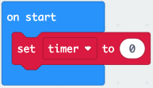
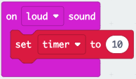
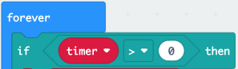
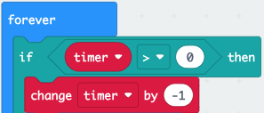
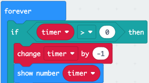
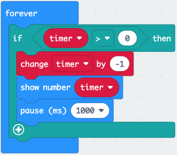

There might be times when you need to time something.

You could show a countdown timer on the LEDs.

<iframe style="position:relative;top:0;left:0;width:100%;height:100%;" src="https://makecode.microbit.org/---codeembed#pub:_eAaWKs4Am53j
" allowfullscreen="allowfullscreen" frameborder="0" sandbox="allow-scripts allow-same-origin"></iframe>

In this code:

- a variable called `timer`{:class='microbitvariables'} is used to hold a number. It is set to `0` when the code first runs.

    

- when there is a loud sound, the value of the `timer`{:class='microbitvariables'} variable is set to `10`.

    

- the forever loop checks if the `timer`{:class='microbitvariables'} variable is more than `0`
  
     0' as the condition." width="200"/>

    if the result of the `timer > 0`{:class='microbitlogic'} comparison is True, (there has been a loud sound): 
    
    ...the `timer`{:class='microbitvariables'} variable value is reduced by `1`...

    

    ...the `timer`{:class='microbitvariables'}  variable value is displayed on the LEDs using the `show number`{:class='microbitbasic'} block
  
    

    ...a one-second (1000 ms) `pause`{:class='microbitbasic'} is added before the loop starts again.
  
    

The example shows the timer starting when there is a loud sound, but you can set the timer to 10 on a different event, for example when the micro:bit is moved, or a button is pressed.